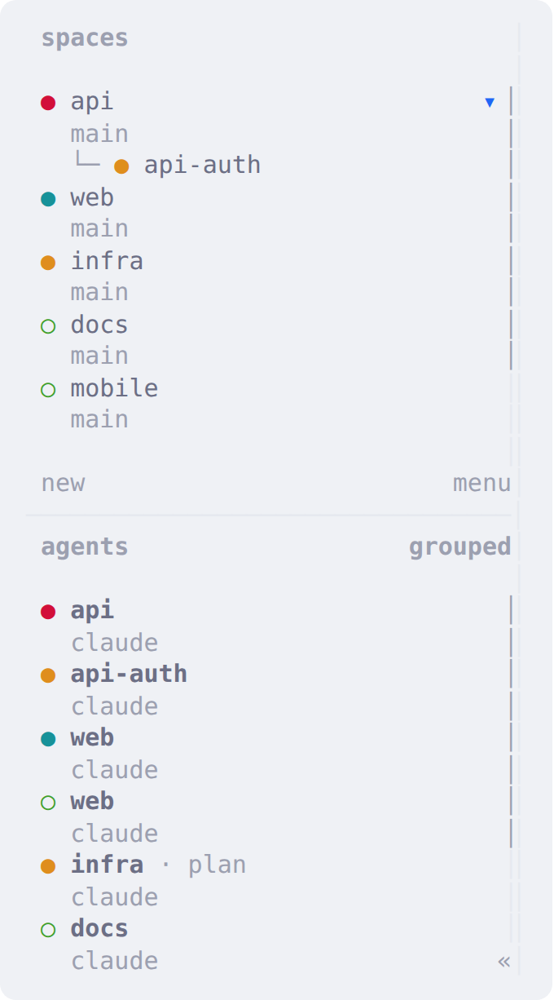
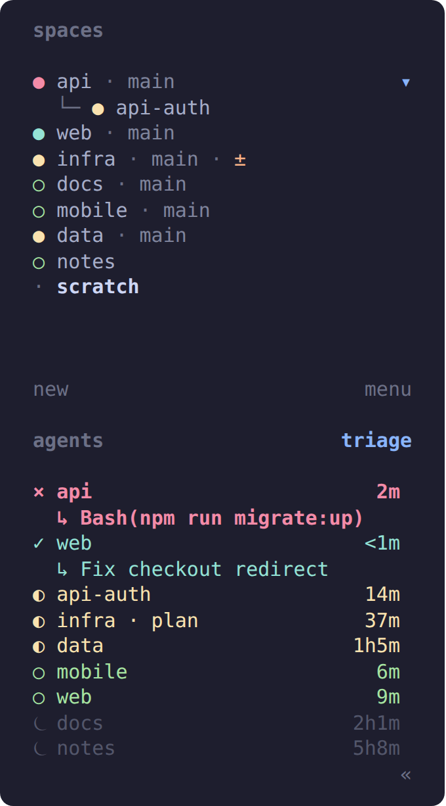
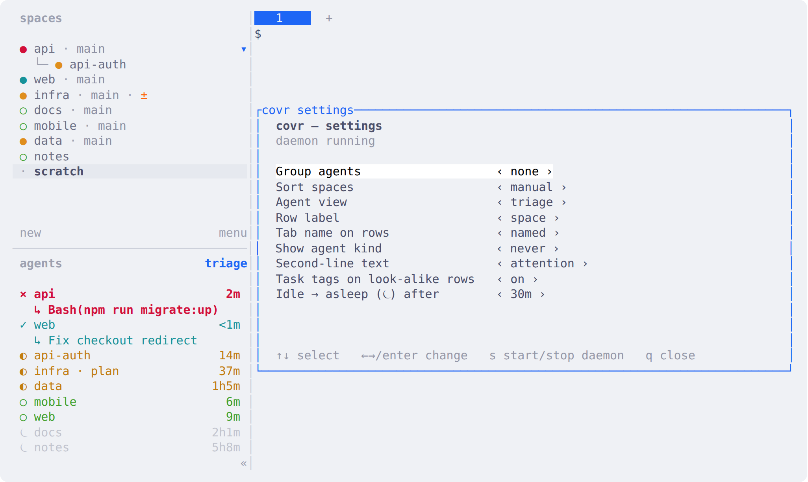

# covr

[](https://github.com/evanbryant/herdr-covr/actions/workflows/tests.yml)


[](LICENSE)

A compact Spaces/Agents sidebar for [herdr](https://herdr.dev). Each agent takes one line, sorted by what needs you. A second line appears only when an agent is blocked (why) or has just finished (what).

| herdr's default sidebar | with covr |
|:---:|:---:|
|  |  |
| 6 of 9 agents fit | all 9, with why `api` is blocked and what `web` finished |

Both screenshots show the same session, captured headless from the test sandbox (`tools/screenshots/`).

## Reading a row

| glyph | state | second line |
|:-:|---|---|
| `×` | blocked, waiting for you | what it is asking, taken from the screen |
| `✓` | finished, not looked at yet | the task it finished |
| `◐` | working | — |
| `○` | idle | — |
| `⏾` | asleep: idle for longer than `stale_after` (30 min), dimmed | — |

- **Order:** blocked, then finished, then working, then idle. Within a state, the most recent change comes first.
- **Stable positions:** rows move only when an agent's state changes, never because an age ticked over.
- **Age:** time in the current state, on the right.
- **Label:** the space name, plus the tab name if you renamed the tab (`infra · plan`). When two rows would look the same, both get a word or two of their task.
- **Spaces:** keep herdr's own rows, plus `±` for uncommitted changes, `!N` on a repo whose worktrees hold N blocked agents, and `★` for a pinned space.

## Install

Needs herdr 0.9.0+, Python 3.8+ (standard library only), Linux or macOS.

```sh
herdr plugin install evanbryant/herdr-covr/plugin
herdr plugin action invoke covr.sidebar.install-layout
```

`install-layout` adds one marked block to herdr's `config.toml` and reloads it:
- **Colours** follow your `[theme] name`: latte colours for light themes, mocha for the rest. Set `layout` to `light` or `dark` to override.
- **Conflicts:** if you already define `[ui.sidebar.spaces]` or `[ui.sidebar.agents]`, it writes nothing and says why.
- **Undo:** `uninstall-layout` removes the block, byte for byte.



## Settings

Bind the settings popup to a key in `config.toml`:

```toml
[[keys.command]]
key = "prefix+comma"
type = "plugin_action"
command = "covr.sidebar.settings"
description = "covr: settings"
```



↑/↓ picks an option and ←/→ changes it; the sidebar updates straight away. `s` starts or stops the daemon.

Every option is also an action you can bind: `cycle-view`, `toggle-group`, `cycle-kind`, `toggle-label`, `cycle-space-sort`, `pin-agent`, `pin-space`, `start`, `stop`, `install-layout`, `uninstall-layout`. `herdr plugin action list --plugin covr.sidebar` lists them.

## Grouping and sorting

`group_by = "project"` lists agents by project. Projects are ordered by their most urgent agent; the project name appears once, and the other agents in it are identified by their task. `group_by = "kind"` groups by agent type (claude, codex, …) instead.


Spaces keep your own order by default. `space_sort` can also be `alpha`, `recent` or `activity`, and switching back to `manual` restores your order. Pinned agents and spaces always come first.

All options, with defaults and limits, are in [docs/spec.md](docs/spec.md#options). They live in `$(herdr plugin config-dir covr.sidebar)/config.toml`.

## How it works

herdr plugins can't draw in the sidebar. They can:
- set short text values (tokens) that the sidebar's row layout displays
- choose one sort and filter for the agents list
- reorder spaces

covr's daemon does all three. It runs once per herdr session, updates when herdr reports an event (and every 5 s regardless), and recovers by itself after a herdr restart. It exits when herdr goes away or when you disable the plugin. Details and known limits: [docs/spec.md](docs/spec.md).

**Privacy:**
- For a blocked agent, covr reads that pane's visible text to show what it is asking.
- For agents already running when covr starts, it estimates the age by finding the Claude Code transcript that contains the session title (under `~/.claude*/projects`) and using the file's modification time.
- It stores only hashes of those lookups.
- Nothing leaves your machine.

## Tests

```sh
python3 -m unittest discover -s tests/unit     # the sidebar logic, under a second
tests/e2e/run.sh                               # lifecycle against an isolated herdr (needs tmux)
HERDR_BIN=/path/to/herdr PYTHON=python3.8 tests/e2e/run.sh restart sessions   # one herdr/Python, some tests
```

Each e2e run gets its own HOME, socket and tmux server, and never touches your herdr. It covers:
- restarts, a server that disappears, and several sessions
- disabling the plugin, the settings popup, and layout install/uninstall
- bad options, log rotation, and code reloads
- a hostile repo's git config

CI runs the unit tests on Linux and macOS (Python 3.8–3.13), and the e2e suite on herdr 0.9.0, 0.9.1 and 0.9.3 (Linux) and 0.9.3 (macOS).

## License

MIT
