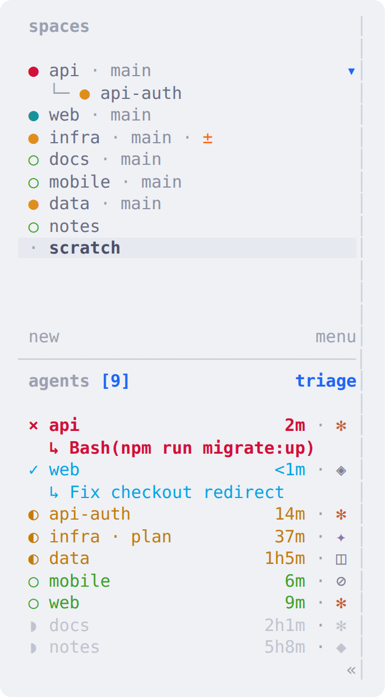
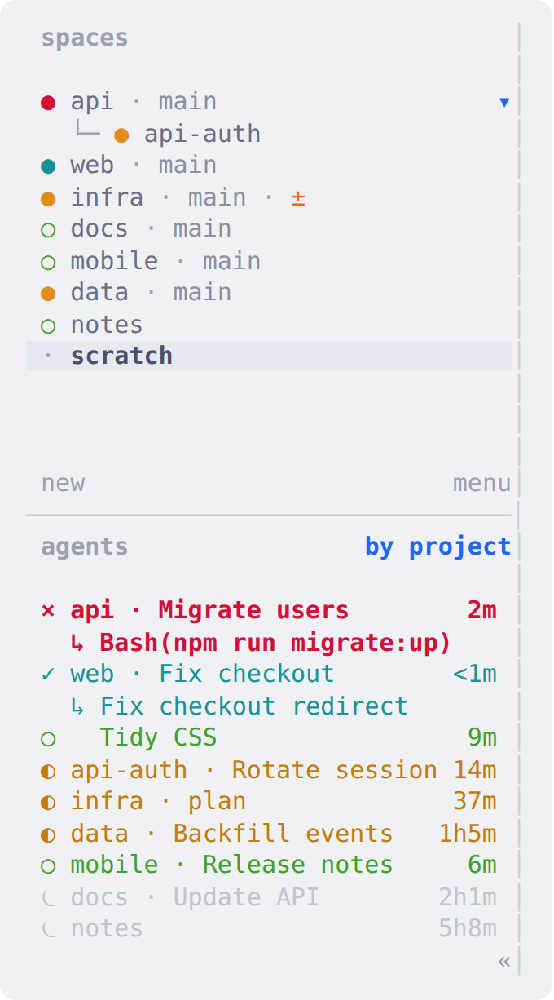

# covr: design and behaviour

This is how covr (plugin id `covr.sidebar`, version 0.3) draws herdr's sidebar and how its daemon behaves. The README covers installation and a quick tour.

## Agents



### Rows

```
× api                        2m   glyph · label [· tab] [· tag] [· kind]      age
  ↳ Bash(npm run migrate:up)      blocked only: what it is asking (red)
✓ web                       <1m
  ↳ Fix checkout redirect         finished and not yet seen: the task (teal)
◗ docs                     2h1m   idle past stale_after (asleep): the whole row dims
```

- **Blocked reason:** read from the pane: the command above an approval prompt, otherwise the last question on screen (`?` or `？`, optionally followed by a `[y/N]` choice). A question that wraps is joined back up and shown from its start, cut at a word with `…`. On Claude Code's question form, the question's short header leads: `Deploy: Ship it?`. Only a real form counts (a line of nothing but `☐`/`☒`/`✔` tabs, with the form's `Enter to select · … · Esc to cancel` footer below), so a todo list is never taken for a header.
- **One token:** the first line is a single token, `$head`, holding the glyph, the label, any extra parts and the age.
- **Right-aligned age:** herdr has no alignment, so the daemon pads the line with U+2800 (a blank that herdr does not trim) to the sidebar's current width.
- **One colour per line:** herdr styles a whole token at once, so the whole line takes its state's colour.
- **Truncation:** long labels are cut at a word boundary with `…`. The space name is shortened before the tab name, and the age is never cut. No token exceeds herdr's 80-character limit.
- **Tabs:** tab names show only for tabs you renamed (`show_tab = named`); auto-numbered tabs are hidden.
- **Look-alike rows:** when two agents in one space and tab would render the same, each gets one or two words of its task (`web · Docs refresh` / `web · Login bug`).
- **Agent kind:** hidden by default (`show_kind`). `auto` shows it while more than one kind runs: on every row, or once per group under `group_by = kind`. `always` puts it on every row under any grouping.
- **Task titles** are herdr's `terminal_title_stripped`; Claude Code sets it to the session title.
- **`label = task`** replaces the space name with the task title. Anything that would repeat the title is then left out (the finished line, the `all` second lines, look-alike tags, tab names). The blocked line stays.

### States

| state | glyph | light / dark colour |
|---|:-:|---|
| blocked | `×` | `#d20f39` / `#f38ba8`, bold, plus the reason line |
| finished, not seen | `✓` | `#179299` / `#94e2d5`, plus the task line |
| working | `◐` | `#c27c0e` / `#f9e2af` |
| idle | `○` | `#40a02b` / `#a6e3a1` |
| asleep (idle past `stale_after`) | `◗` | `#9ca0b0` / `#7f849c`, dimmed |
| unknown | `·` | `#9ca0b0` / `#7f849c` |
| pinned (any state) | ` ★` after the label | the state's colour |

### Order

The agents list uses one herdr Agent view.
- **Sort:** pinned first, then attention (blocked > finished > working > idle), then the most recent state change.
- **Stable ranking:** an agent's rank is set by the moment it entered its current state, so rows move only when a state changes, never as ages tick.
- **Viewed restarts the timer:** herdr reports a finished agent as `done` until it is viewed, then as `idle`, without counting that as a state change. covr restarts the agent's timer at that moment, however it was viewed, so the idle age and the `stale_after` countdown run from the view, not from the finish.
- **Selected and finished:** herdr's server marks an agent viewed only on an explicit focus. An agent that finishes while it is already the selected pane (for example with the terminal in the background) can therefore stay `done`. After `seen_after` (default 5 s), covr focuses it where it is, which marks it viewed and moves nothing. The daemon wakes at the due time, not at its next tick.
- **Age source:** the age is time in the current state, as the daemon observes it; it remembers start times across restarts. An agent already in its state when the daemon first sees it has no age until its state changes. With `age_source = claude-transcripts` (opt-in), that start time is taken from the newest Claude Code transcript that mentions the session title.

### Grouping



**By project** (`group_by = project`, where each space is a project):
- A project's rank is its most urgent agent's rank; pinned spaces lead.
- The project name appears on the first agent only. The others are indented and labelled by their task.
- The list header shows `by project`.

**By kind** (`group_by = kind`) groups claude, codex and so on:
- The kind is named once per group, and a dim rule closes each group.
- With only one kind running, neither the name nor the rule is shown.

In both modes the daemon gives each agent a group number, `grp`, and the view sorts by it before everything else.

### Views

| `view` | shows |
|---|---|
| `triage` | everything |
| `needs me` | blocked and finished agents |
| `here+` | the current space, plus anything blocked or finished elsewhere |

<br clear="right">

## Spaces

- **Row:** herdr's own space row, plus three markers:
  - `!N` (red) on a repo whose worktree spaces hold N blocked agents. herdr's own rollup ignores worktrees.
  - `±` (peach) when `git status` finds uncommitted changes. This is checked every 30 s, with the repo's `core.fsmonitor` disabled and without taking git's index lock.
  - `★` for a pinned space.
- **Sorting** (`space_sort`). herdr has no sort setting for spaces, so the daemon moves them with `workspace.move_block`:

  | mode | order |
  |---|---|
  | `manual` (default) | yours; nothing moves unless you pin a space |
  | `alpha` | by name |
  | `recent` | most recently focused first |
  | `activity` | by most urgent agent; your order breaks ties |

  - Pinned spaces lead, and worktree spaces stay under their repo.
  - Your manual order is saved before the first reorder and restored when you switch back.
  - Space numbers (`prefix+1..9`) follow the displayed order.
  - If something keeps moving spaces back (3 re-applied orders within 60 s), sorting pauses for 5 minutes, with one notification.

## Pinning

`pin-agent` pins the focused agent and `pin-space` pins the current space. Pinned items lead their list, or their group when grouped. Pins are stored in the plugin's state directory and shared by all herdr sessions. Pins for closed panes are dropped.

## Options

Options are stored in `$(herdr plugin config-dir covr.sidebar)/config.toml`. The settings popup and actions write this file, and the daemon reads it every tick.
- **Invalid values:** `set` refuses them. In a hand-edited file they are ignored, with one log line and one notification each.
- **Old Pythons:** before Python 3.11 (no `tomllib`), the file is read by a small built-in parser.

| option | values (default first) |
|---|---|
| `group_by` | `none` · `project` · `kind` |
| `space_sort` | `manual` · `alpha` · `recent` · `activity` |
| `view` | `triage` · `needs me` · `here+` |
| `label` | `space` · `task` |
| `show_tab` | `named` · `always` · `never` |
| `show_kind` | `never` · `auto` (only while more than one kind runs) · `always` |
| `show_task` | `attention` (blocked reason and finished task) · `all` · `never` |
| `disambiguate` | `true` · `false` |
| `stale_after` | `30m`; any duration from `1m` to `30d` |
| `seen_after` | `5s`; `off`, or any duration from `1s` to `1h` |
| `tick_seconds` | `5`; from 2 to 60 |
| `layout` | `auto` · `light` · `dark` (used by `install-layout`) |
| `age_source` | `observed` · `claude-transcripts` (opt-in: reads transcript files under `~/.claude*/projects`) |

## Actions

`settings` opens the popup. The others:
- `cycle-view`, `toggle-group`, `cycle-kind`, `toggle-label` and `cycle-space-sort` step through an option.
- `pin-agent` and `pin-space` pin and unpin.
- `start` and `stop` control the daemon.
- `install-layout` and `uninstall-layout` manage the layout block.

Bind any of them in herdr's `config.toml` as `type = "plugin_action"`, `command = "covr.sidebar.<action>"`.

## Daemon

`bin/covrd.py` is a Python standard-library daemon, one per herdr session, keyed by the session's socket.

- **Updates:** on every tick (5 s), and immediately when a hook fires. The hooks are agent status and detection, pane focus and close, workspace create, close, rename, focus and reorder, tab rename, and worktree open. Bursts are merged into at most one update per 0.5 s, and a hook costs about 15 ms (`bin/poke.py`).
- **Diffing:** it reads `agent.list`, `workspace.list` and `tab.list`, and sends only changed tokens (`report-metadata --source covr --seq …`).
- **Sequencing:** reports carry a strictly increasing `--seq`, so a late write can't undo `stop`. If herdr keeps rejecting the numbers, the daemon switches to plain reports.
- **Recovery:** when herdr stops showing its tokens (a restart or live handoff), it sends all of them and the view again. The `[[startup]]` hook triggers the same resync.
- **Exit:** it exits after 60 s without herdr, and it clears its tokens and exits when the plugin is disabled or unlinked.
- **One daemon per session:** a lock held for the daemon's lifetime keeps concurrent starts safe.
- **Code updates:** it restarts itself when its code changes on disk.
- **Sidebar width:** read from this session's herdr client preferences (the width you dragged to), else `ui.sidebar_width`, else 26.
- **State:** stored under the plugin's state directory, in `s/<session hash>/`. New files are readable only by you. Cached transcript lookups are stored as hashes and pruned to live panes, and the log rotates at 256 KB.

`bin/layout.py` manages the block between `# >>> covr.sidebar layout` and `# <<< covr.sidebar` in herdr's `config.toml`:
- **Idempotent:** installing twice changes nothing.
- **Clean undo:** uninstalling removes exactly what install added.
- **Conflicts:** it refuses a config that would define the same tables twice.
- **Rollback:** it restores the old file if `herdr server reload-config` fails.
- **Older blocks:** a block written by an older covr version is recognised. Run `install-layout` again after an upgrade, so the block's colour rules match the current glyphs (0.4.3 changed asleep to `◗`).

## Platforms

The same code runs on Linux, macOS and Windows. Only a few mechanisms differ:

| | Linux / macOS | Windows |
|---|---|---|
| herdr's API | Unix socket at `HERDR_SOCKET_PATH` | named pipe `\\.\pipe\<HERDR_SOCKET_PATH>` |
| one daemon per session | `fcntl.flock` on `covrd.lock` | `msvcrt.locking` on `covrd.lock` |
| waking the daemon (hooks, resync, stop) | `SIGUSR1` / `SIGUSR2` / `SIGTERM` | a word appended to the `wake` file, checked every 0.1 s |
| detaching the daemon | new session | detached process group, broken away from the hook's job |
| settings popup | curses | VT escape sequences, keys through `msvcrt` |
| herdr's config / state | `~/.config/herdr` / `~/.local/state/herdr` | `%APPDATA%\herdr` / `%LOCALAPPDATA%\herdr` |

- **Paths:** herdr's own directories are found from the plugin directories herdr passes, so XDG overrides and Windows profile folders need no special handling.
- **Encoding:** every file and subprocess uses UTF-8 explicitly, because Windows Python's default encoding is not UTF-8.
- **Child processes:** on Windows, `git` and `herdr` run without a console window.

## Known limits

- **No daemon, no rows:** if the daemon is not running, agent rows are empty, because their text comes from the daemon's tokens. `start`, or a herdr restart, brings it back.
- **One colour per line**, as herdr can't style part of a token.
- **Resizing:** after you drag the sidebar wider or narrower, alignment catches up within one tick.
- **Sorting moves spaces:** any `space_sort` other than `manual` really moves spaces, which renumbers them.
- **The split** between Spaces and Agents is herdr's; drag it once.
- **Sort labels aren't clickable.** herdr makes the Agents sort label clickable only for its own two sorts. With a plugin view active the label does nothing, and plugins get no sidebar click events. Switch with the actions (bound to keys) or the settings popup.
- **Windows:** herdr's plugin support there is a preview. The settings popup is tested by driving it directly, not inside herdr's popup pane (the test herdr runs without a client window).
